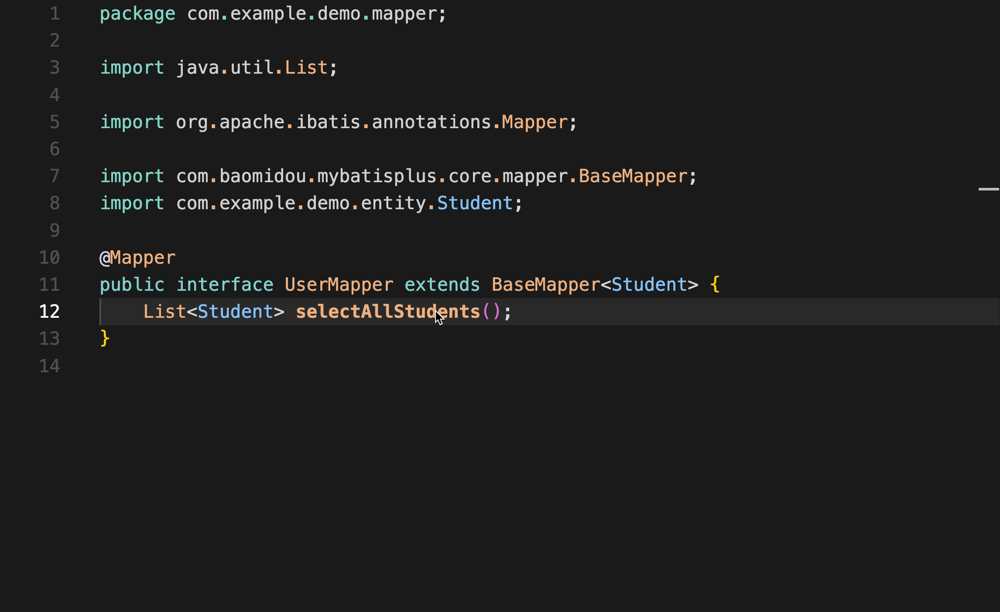

# MyBatis Jump Mapper XML Extension

A simple VS Code extension that lets you quickly jump from a MyBatis Mapper method in Java to its corresponding SQL definition in the XML file.

## Features
- Instantly navigate from a Mapper method to its SQL definition in the XML.

## How to Use
1. **Right-click** on a Mapper method in your Java file.
2. Select **"Go to Mapper Definition"** from the context menu.
3. You will be taken directly to the corresponding SQL statement in the XML file.

See it in action:

## Limitations
- The extension assumes that the Java Mapper file and the XML file share the same prefix. For example, `UserMapper.java` and `UserMapper.xml`.
- If the file prefixes do not match, the extension will not work as expected.

---

**Enjoy using MyBatis Jump Mapper XML!**
